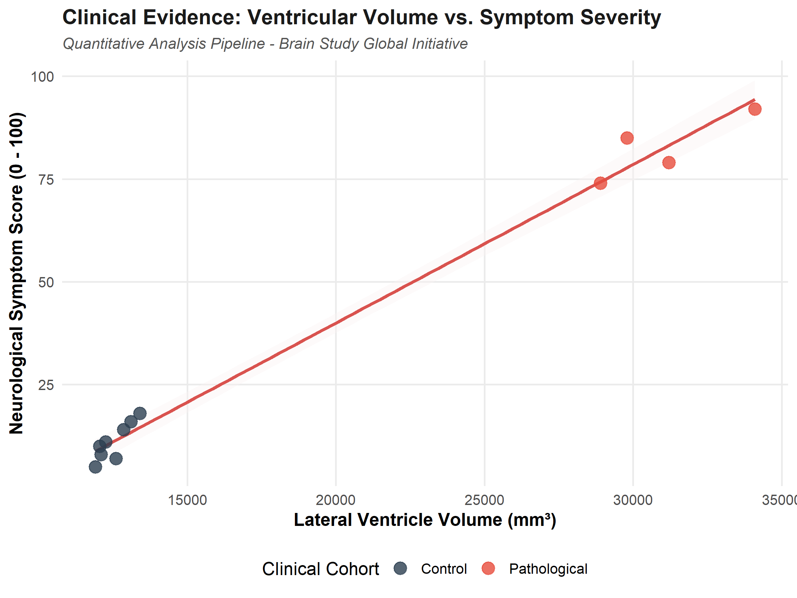

# meu-primeiro-projeto
"Repositório criado para aprender os comandos básicos de Git e GitHub".
# Análise de Evidência Clínica: Volume Ventricular vs. Severidade de Sintomas

Este repositório contém o pipeline de análise quantitativa utilizado para correlacionar o volume dos ventrículos laterais com a escala de severidade neurológica em coortes clínicas (Controles vs. Patológicos).

## 📊 Metodologia e Tecnologias
- **Linguagem:** R (v4.5.3)
- **Pacotes Principais:** `ggplot2` para visualização de dados de alta resolução.
- **Análise:** Modelagem de regressão linear para avaliação de biomarcadores estruturais.

## 📈 Resultados obtidos
O gráfico gerado demonstra uma correlação linear positiva robusta entre o aumento volumétrico ventricular e o agravamento do score sintomático no grupo patológico.

